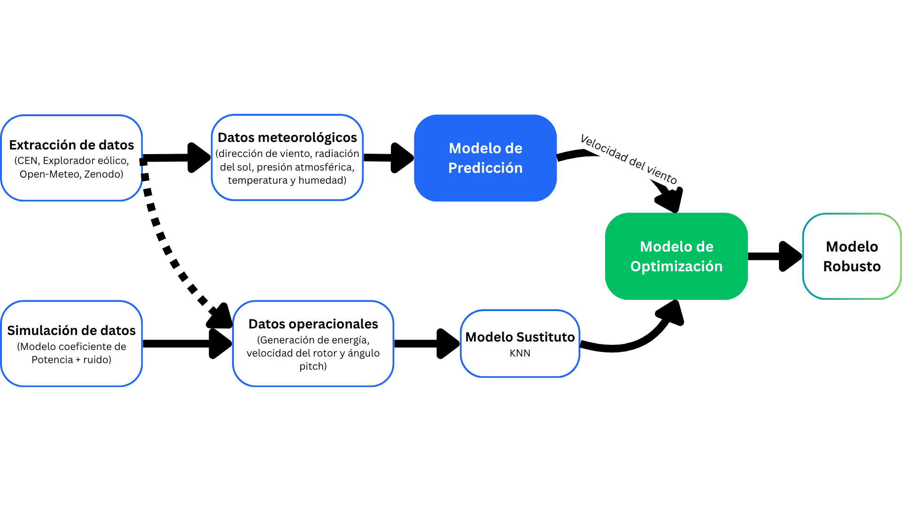
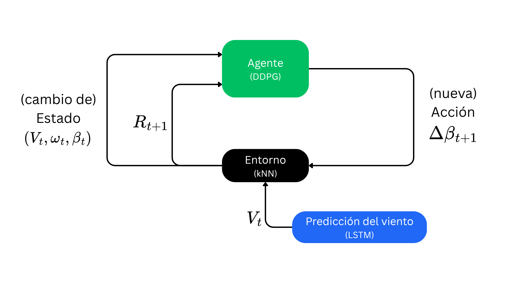
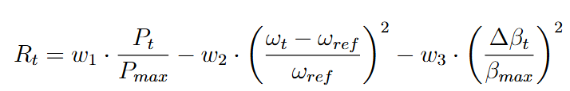
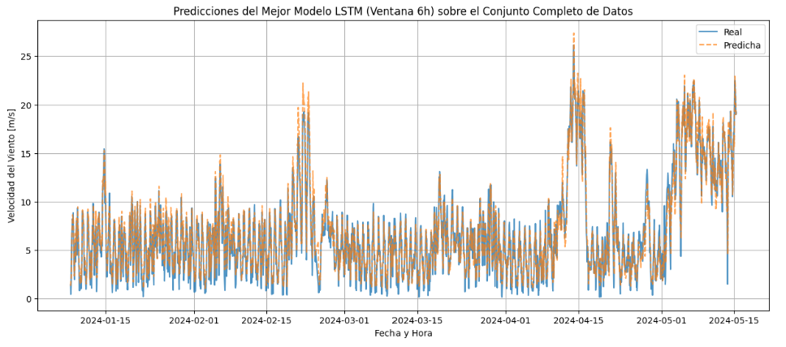
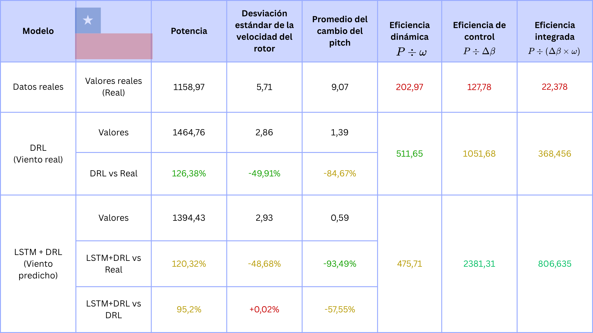
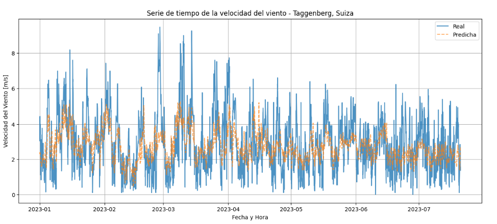
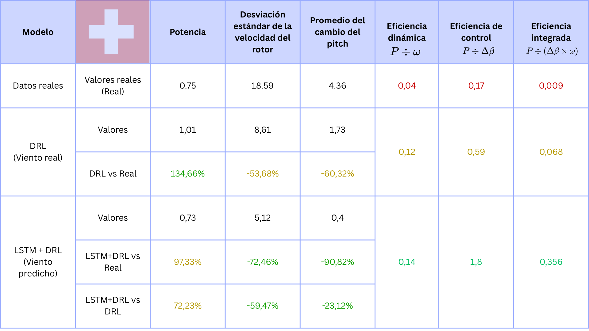

# Control multiobjetivo del ángulo de paso en turbinas eólicas mediante un modelo híbrido de predicción y optimización

---

## 📌 Problema
La **velocidad del viento es estocástica**, no se puede saber con certeza su disponibilidad. 
Además, los **controladores tradicionales reaccionan al viento observado y suelen asumir comportamientos lineales. Esto limita su capacidad para operar bajo incertidumbre y equilibrar simultáneamente captura energética, estabilidad del rotor y desgaste mecánico.

El **control del ángulo de paso (pitch)** el componente con mayor impacto en la eficiencia y seguridad de un aerogenerador. 
Sin embargo, la mayoría de los controladores inteligentes optimizan un solo objetivo: la potencia.  

En la práctica, un operador necesita optimizar simultáneamente:  
- **Máxima energía**  
- **Estabilidad del rotor**  
- **Reducción de cambios bruscos en el ángulo de las palas**  

---

## ⚙️ Arquitectura del modelo híbrido

| Flujo de datos | Deep Reinforcement Learning |
|-------------------------|----------------------|
|  |  |

**Módulo 1 — Predicción (LSTM)**  
Pronostica la velocidad del viento mediante una red LSTM alimentada de datos meteorológicos

**Módulo 2 — Entorno (kNN)**  
Modela la dinámica de los datos operacionales relacionandolos mediante un K-Nearest neightboors. Se utiliza debido a la confidencialidad de los datos de la trurbina con el fin de obtener una transición de estados.

**Módulo 3 — Control (DDPG)**  
Agente DDPG, en el paradigna de Deep Reinforcement Learning, que ajusta el ángulo de paso optimizando:  
- Potencia generada  
- Estabilidad del rotor  
- Reducción de fatiga mecánica  

### Recompensa del Agente

> Maximizar la generación de energía, minimizar el penalizar la desviación de la velocidad nominal del rotor, sancionando los cambios abruptos de la acción.

- R_t: Recompensa en el tiempo t.
- w₁, w₂, w₃: Pesos relativos de cada objetivo.
- Pₜ, Pₘₐₓ: Potencia en el tiempo t, Potencia máxima.
- ωₜ, ωᵣₑ𝒻: Velocidad angular del rotor, Velocidad angular de referencia del rotor.
- βₜ, Δβₜ, βₘₐₓ: Ángulo de paso en el tiempo t, Cambio del ángulo en el tiempo t, ángulo máximo.

---

## 📊 Resultados

### Chile (Taltal, Vestas V-112, 3 MW)
**Predicción LSTM**

- R^2 Lineal: 0.596
- R^2 LSTM: 0.927
> La red LSTM tiene un mejor coeficiente de determinación que el modelo OLS.

**Control DDPG**

### Suiza (Taggenberg, Aventa AV-7, 6 kW)
**Predicción LSTM**

- R^2 Lineal: 0.125
- R^2 LSTM: 0.283 
> La red LSTM tiene un mejor coeficiente de determinación que el modelo OLS. No es similarmente mejor que en el caso de Chile pero es relevante. 

> Cabe destacar que no se busca el mejor modelo de predicción si no como esta interactúa con el agente.

**Control DDPG**

> En ambos casos, el modelo híbrido supera la eficiencia obtenida con viento real y datos reales, demostrando un mejor balance entre rendimiento energético y estabilidad de control.

---

## 👤 Autor

**Alonso Romero Sánchez**  
Ingeniero Civil Industrial | Data Science · ML · Deep RL  

  
  

*Si este proyecto te resulta útil o tienes preguntas, escríbeme — me interesa conectar.*
